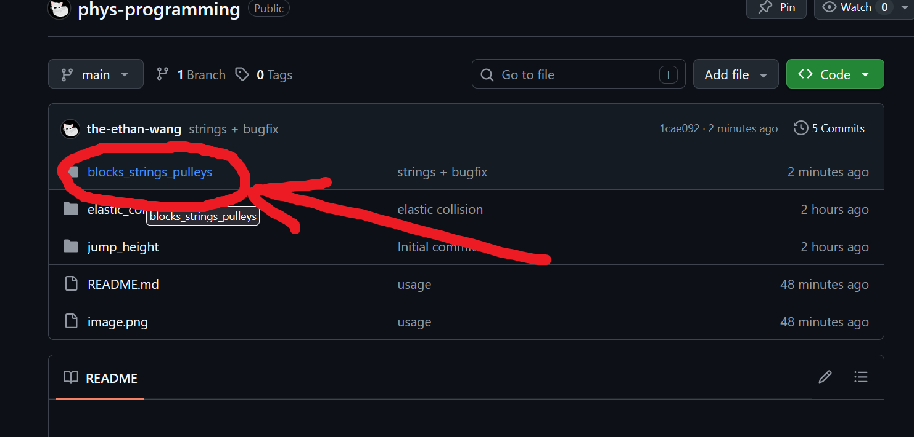

# phys programming

phys programming 

code all by me owo

## Includes:

- jump height
- elastic collision
- blocks, ~~strings, pulleys~~ (still WIP)

## Usage

to see a inside one just click on it 

or like go this link if you cant(?)

https://github.com/the-ethan-wang/phys-programming/tree/main/blocks_strings_pulleys
